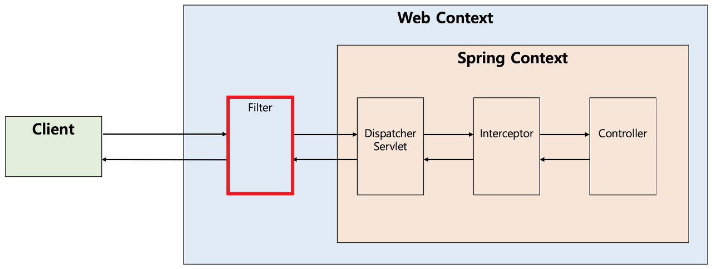
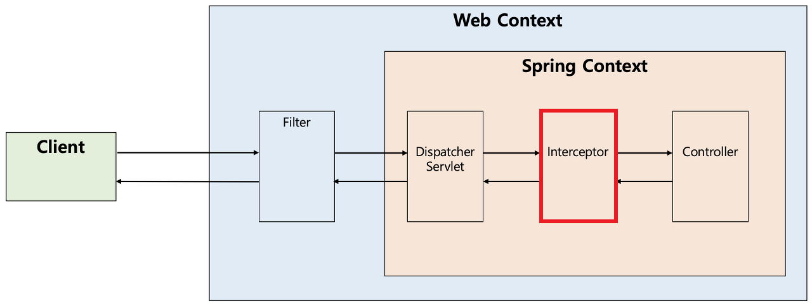
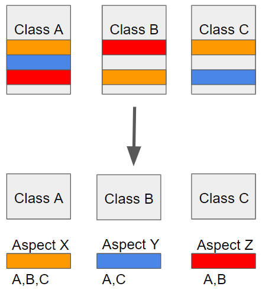

## DAO와 DTO
### DAO(Data Access Object)
데이터베이스의 데이터에 접근하기 위한 객체로, 데이터베이스에 접근하기 위한 로직 & 비즈니스 로직을 분리하기 위해 사용한다.


### DTO(Data Transfer Object)
계층 간 데이터 교환을 하기 위해 사용하는 객체로, DTO는 로직을 가지지 않는 순수한 데이터 객체다. 

## MVC 패턴
**Model - View - Controller**의 약자로 애플리케이션을 세 가지 역할로 구분한 개발 방법론이다. </br>

 </br>

### 특징
- 기본적으로 Blocking이고 동기 방식을 사용한다.
- 사용자의 요청이 들어올 때마다 Thread를 생성해 처리한다.
- 보통은 요청 시마다 스레드를 생성, 삭제해주면 일정한 리소스가 지속적으로 소모되므로 Thread를 미리 생성해 저장해두는 Thread Pool을 생성해 사용한다.
- 따라서 Spring MVC 같은 경우 요청이 들어오면 그 요청을 Queue에 쌓고 순서에 따라서 스레드를 하나 점유해 요청을 처리한다.
- 동시 다발적으로 스레드 수를 초과하는 요청이 발생하면 계속해서 요청이 큐에 대기하게 되는 Thread Pool Hell 현상이 발생할 수 있다.


### Model
**애플리케이션의 정보, 데이터를 나타낸다.**
- 사용자가 편집하길 원하는 모든 데이터를 가지고 있어야 한다.
- 뷰나 컨트롤러에 대해서 어떤 정보도 알면 안된다.
- 변경이 일어나면, 변경 통지에 대한 처리 방법을 구현해야만 한다.

### View
**사용자에게 보여지는 부분, 즉 유저 인터페이스를 의미한다.** </br>
MVC 패턴은 여러 개의 뷰가 존재할 수 있으며, 모델에게 질의하여 데이터를 전달받는다.

뷰는 받은 데이터를 화면에 표시해주는 역할을 하며, 모델에게 전달받은 데이터를 별도로 저장하지 않아야 한다.

사용자가 화면에 표시된 내용을 변경하게 되면 모델에게 전달해 모델을 변경해야 한다.

- 모델이 가지고 있는 정보를 따로 저장해서는 안된다.
- 모델이나 컨트롤러와 같이 다른 구성 요소들을 몰라야 한다.
- 변경이 일어나면 변경통지에 대한 처리방법을 구현해야만 한다.

### Controller
**모델과 뷰 사이를 이어주는 다리 역할을 의미한다.**

모델이나 뷰는 서로의 존재를 모르며, 변경 사항을 외부로 알리고 수신하는 방법만 있다.

컨트롤러는 이를 중재하기 위해 모델과 뷰에 대해 알고 있어야 하며, 모델이나 뷰로부터 변경 내용을 전달받으면 이를 각 구성 요소에게 통지해야 한다.

사용자가 애플리케이션을 조작하여 발생하는 변경 이벤트들을 처리하는 역할을 수행한다.

- 모델이나 뷰에 대해 알고 있어야 한다.
- 모델이나 뷰의 변경을 모니터링 해야 한다.

### 왜 사용할까?
`유지보수의 편리성`

최초 설계를 꼼꼼히 진행한 시스템이라도 유지보수가 발생하기 시작하면 각 기능간의 결합도(coupling)가 높아지는 경우가 발생한다.

이는 최초 설계 이념을 정했던 사람들의 부재 혹은 비즈니스 요건 변경으로 인해 필연적으로 발생한다.

결합도가 높아진 시스템은 유지보수 작업 시 다른 비즈니스 로직에 영향을 미치게 되므로 사소한 코드의 변경이 의도치 않은 버그를 유발할 수 있다.

MVC 패턴을 가진 시스템의 각 컴포넌트는 자신이 맡은 역할만 수행한 후 다른 컴포넌트로 결과만 넘겨주면 되기 때문에 시스템 결합도를 낮출 수 있다.

유지보수 시에도 특정 컴포넌트만 수정하면 되기 때문에 보다 쉽게 시스템 변경이 가능하다.

### 한계
복잡한 대규모 프로그램의 경우 다수의 뷰와 모델이 컨트롤러를 통해 연결되기 때문에 컨트롤러가 불필요하게 커지는 현상이 발생한다.

복잡한 화면을 구성하는 경우에도 동일한 현상이 발생하는데 이를 **'Massive-View-Controller'** 라고 한다. </br>
 </br>
https://www.infoq.com/news/2014/05/facebook-mvc-flux/

이러한 문제점을 보완하기 위해 다양한 패턴이 파생되었다.
- MVP 패턴
- MVVM
- Flux
- Redux
- RxMVVM

**reference** </br>
https://junhyunny.github.io/information/design-pattern/mvc-pattern/ </br>
https://thalals.tistory.com/381

## mvc vs webflux
### webflux
> Spring 5에서 새롭게 추가된 모듈로 클라이언트, 서버에서 reactive 스타일의 애플리케이션 개발을 도와준다.</br>
> reactive-stack web framework이며 non-blocking에 reactive stream을 지원한다.

**특징**
- Event-Driven 방식으로 요청을 처리하며 논블로킹 방식이다.
- 이벤트 루프가 돌아서 요청이 발생할 경우 그것에 맞는 핸들러에게 처리를 위임하고 처리가 완료되면 callback 메소드 등을 통해 응답을 반환한다.
- 이 방식의 경우 요청이 처리될 때까지 기다리지 않기 때문에 Spring MVC에 비해 사용자의 요청을 대량으로 받아낼 수 있다는 장점이 있다.

**장점**
- 고성능
- spring과 완벽한 통합
- netty 지원
- 비동기 non-blocking 메세지 처리

**단점**
- 다소 복잡한 오류 처리

### Spring MVC vs WebFlux
**공통점**
- @Controller, Reactive 클라이언트
  - 둘 다 tomcat, Jetty, Undertow와 같은 서버에서 실행할 수 있다.

**차별점**
- Spring MVC
  - 명령형 논리, JDBC, JPA를 가질 수 있다.
- Spring WebFlux
  - 기능적 엔드포인트, 이벤트 루프, 동시성 모델을 가질 수 있다.
  - Netty 서버에서 실행할 수 있다.

### mono, flux
Spring Webflux에서 사용하는 reactive library가 Reactor이고 Reactor가 Reactive Streams의 구현체다.<br>
그래서 Webflux 문서에 Reactive Streams가 언급되는 것이고 그와 같이 Reactor가 나오고 주요 객체인 Mono / Flux가 나오게 된다. </br>
결국 Webflux의 동작 구조를 이해하는 Flux와 Mono를 알고 넘어가야 한다.

Flux와 Mono의 차이점은 발생하는 데이터 갯수이다.
- Flux: 0 ~ N개의 데이터 전달
- Mono: 0 ~ 1개의 데이터 전달

**Mono**

Mono는 Reactive Steams의 Publisher 인터페이스를 구현하는 구현체이다.

**Flux**

Reactive Streams에서 정의한 Publisher의 구현체로서, 0-N개의 데이터를 발행(전달, 방출)할 수 있다. </br>
하나의 데이터를 전달할 때마다 onNext 이벤트를 발생시킨다. Flux 내의 모든 데이터의 전달 처리가 완료되면 onComplete 이벤트가 발생하며, 
데이터를 전달하는 과정에서 오류가 발생하면 onError 이벤트가 발생한다.


**Reference** </br>
https://devuna.tistory.com/108
https://devuna.tistory.com/120

## Filter와 Interceptor
스프링은 공통적으로 여러 작업을 처리함으로써 중복된 코드를 제거할 수 있는 3가지 기능을 지원한다. 

1. Filter
2. Interceptor
3. AOP(Aspect Oriented Programming, 관점 지향 프로그래밍)

### Filter
> 요청과 응답을 거른 뒤 정제하는 역할

Dispatcher Servlet에 요청이 전달되기 전후에 url 패턴에 맞는 모든 요청에 대해 부가 작업을 할 수 있는 기능 제공

스프링 컨테이너가 아닌 톰캣과 같은 웹 컨테이너에 의해 관리되며, 스프링 범위 밖에서 처리되는 것</br>



필터를 초기화하기 위해서는 javax.servlet의 Filter 인터페이스를 구현해야 하며, 다음과 같은 메소드를 가진다.

```
public interface Filter {

  public default void init(FilterConfig filterConfig) throws ServletException {}

  public void doFilter(ServletRequest request, ServletResponse response,FilterChain chain) throws IOException, ServletException;

  public default void destroy() {}
```
1. init()
   - 필터 객체를 초기화하고 서비스에 추가하기 위한 메소드
   - 웹 컨테이너가 1회 init()을 호출해 필터 개체를 초기화하면 이후 요청들은 doFilter()를 통해 처리된다.


2. doFilter()
  - url-pattern에 맞는 모든 HTTP 요청이 디스패처 서블릿으로 전달되기 전에 웹 컨테이너에 의해 실행되는 메소드
  - doFilter의 파라미터로 FilterChain이 있는데, filterChain의 doFilter를 통해 다음 대상으로 요청을 전달할 수 있게 된다.
  - chain.doFilter()로 전후에 우리가 필요한 처리 과정을 넣어줌으로써 원하는 처리를 진행할 수 있다.

3. Destroy()
  - 필터 객체를 제거하고 사용하는 자원을 반환하기 위한 메소드
  - 웹 컨테이너가 1회 destroy()를 호출해 필터 객체를 종료하면 이후에는 doFilter에 의해 처리되지 않는다.


### Interceptor
> Dispatcher Servlet이 Controller를 사용하기 전후에 인터셉터가 끼어들어 요청과 응답을 참조하거나 가공할 수 있는 기능을 제공한다. </br>
> 웹 컨테이너에서 동작하는 필터와 달리 인터셉터는 스프링 컨텍스트에서 동작한다.

디스패처 서블릿이 핸들러 매핑을 통해 컨트롤러를 찾도록 요청하는데, 그 결과로 실행 체인(HandlerExcutionChain)을 돌려준다. </br>
여기서 하나 이상의 인터셉터가 등록되어 있다면 순차적으로 인터셉터들을 거쳐 컨트롤러가 실행되도록 하고, 인터셉터가 없다면 바로 컨트롤러를 실행한다.



인터셉터를 추가하기 위해서는 org.springframework.web.servlet의 HandlerInterceptor 인터페이스를 구현해야 하며, 다음과 같은 메소드들을 가진다.

```
public interface HandlerInterceptor {
 
	default boolean preHandle(HttpServletRequest request, HttpServletResponse response, Object handler) throws Exception {
		return true;
	}
 
	default void postHandle(HttpServletRequest request, HttpServletResponse response, Object handler, @Nullable ModelAndView modelAndView) throws Exception {
	}
 
	default void afterCompletion(HttpServletRequest request, HttpServletResponse response, Object handler, @Nullable Exception ex) throws Exception {
	}
```

1. preHandle()
  - 컨트롤러가 호출되기 전에 실행된다.
  - 컨트롤러 이전에 처리해야 하는 전처리 작업이나 요청 정보를 가공하거나 추가하는 경우에 사용할 수 있다.

2. postHandle()
    - 컨트롤러가 호출된 후에 실행된다. (View 렌더링 전)
    - 컨트롤러 이후에 처리해야 하는 후처리 작업이 있을 때 사용할 수 있다.
    - 컨트롤러가 반환하는 ModelAndView 타입의 정보가 제공되는데, 최근에는 JSON 형태로 데이터를 제공하는 RestAPI 기반의 컨트롤러를 만들면서 자주 사용되지 않는다.

3. afterCompletion()
   - 모든 뷰에서 최종 결과를 생성하는 일을 포함해 모든 작업이 완료된 후에 실행된다. (View 렌더링 후)
   - 요청 처리 중에 사용한 리소스를 반환할 때 사용할 수 있다.

**인터셉터와 AOP**

인터셉터 대신 컨트롤러에 적용할 부가기능을 어드바이스로 만들어 AOP를 적용할 수도 있다. </br>
하지만 다음과 같은 이유로 컨트롤러의 호출 과정에 적용되는 부가기능들은 인터셉터를 사용하는 것이 낫다.

1. 컨트롤러는 타입과 실행 메소드가 모두 제각각이라 포인트컷(적용할 메소드 선별)의 작성이 어렵다.
2. 컨트롤러는 파라미터나 리턴 값이 일정하지 않다.

즉, 타입이 일정하지 않고 호출 패턴도 정해져 있지 않기 때문에 컨트롤러에서 AOP를 적용하려면 번거로운 부가작업들이 생기게 된다.

**필터와 인터셉터**

1. 필터는 Request와 Response를 조작할 수 있지만, 인터셉터는 조작할 수 없다.
2. 사용 사례
   1. 필터
      - 보안 및 인증/인가 관련 작업
      - 모든 요청에 대한 로깅 또는 검사
      - 이미지/데이터 압축 및 문자열 인코딩
      - Spring과 분리되어야 하는 기능
      - 스프링과 무관하게 전역적으로 처리해야 하는 작업들을 처리할 수 있으며, 인터셉터보다 앞단에서 동작하기 때문에 보안검사(XSS 방어 등)를 통해 올바른 요청이 아닐 경우 차단하 ㄹ수 있다.
      - 웹 애플리케이션에 전반적으로 사용되는 기능들을 구현하기에 적당하다.

   2. 인터셉터
      - 세부적인 보안 및 인증/인가 공통 작업
      - API 호출에 대한 로깅 또는 검사
      - 컨트롤러로 넘겨주는 정보(데이터)의 가공
      - 클라이언트의 요청과 관련되어 전역적으로 처리해야 하는 작업들을 처리할 수 있다.
      - HttpServletRequest나 HttpServletResponse 등과 같은 객체를 제공받으므로 객체 자체를 조작할 수 없다.
      - 대신 해당 객체가 내부적으로 갖는 값은 조작할 수 있으므로 컨트롤러로 넘겨주기 위한 정보를 가공하기에 용이하다.
      - ex) JWT 토큰 정보를 파싱해서 컨트롤러에게 사용자 정보를 제공하도록 가공
      
3. 필터와 인터셉터 모두 비즈니스 로직과 분리되어 특정 요구사항(보안, 인증, 인코딩 등)을 만족시켜야 할 때 적용한다.
4. 필터는 특정 요청과 컨트롤러에 관계없이 전역적으로 처리해야 하는 작업이나 웹 어플리케이션에 전반적으로 사용되는 기능을 구현할 때 적용하고,
인터셉터는 클라이언트의 요청과 관련된 작업에 대해 추가적인 요구사항을 만족해야 할 때 적용한다.

**Reference** </br>
https://dev-coco.tistory.com/173

## AOP(Aspect Oriented Programming, 관점 지향 프로그래밍)
> 어떤 로직을 기준으로 핵심적인 관점, 부가적인 관점으로 나누어 보고 그 관점을 기준으로 각각 모듈화하는 것

흩어진 관심사(Crosscutting Concerns)를 모듈화할 수 있는 프로그래밍 기법



여기서의 색깔 블록은 중복되는 메서드, 필드, 코드 등이고

클래스 A의 주황색 블록 부분을 수정해야 한다면 클래스 B,C의 주황색 부분도 일일이 찾아 수정해야 한다.

-> SOLID 원칙을 위배하며 유지보수를 어렵게 만든다.

이런 식으로 소스 코드상에서 계속 반복해서 사용되는 부분을 `흩어진 관심사(Crosscutting Concerns)`라고 하며,

결국 각 관점을 기준으로 모듈화한다는 것은 흩어진 관심사를 모듈화하겠다는 의미이다.

이 때 모듈화시켜둔 블록을 `Aspect`라고 한다.

**특징**
- 스프링에서 제공하는 스프링 AOP는 프록시 기반의 AOP 구현체이다.
  - 따라서 AOP를 적용하려면 항상 프록시를 통해 대상 객체(Target)를 호출해야 한다.
  - AOP를 적용하면 스프링은 대상 객체 대신 프록시를 스프링 빈으로 등록한다. 
    - 따라서 스프링은 의존관계 주입 시 항상 프록시 객체를 주입한다.


- 프록시 객체를 사용하는 것은 접근 제어 및 부가 기능을 추가하기 위해서이다.


- 스프링 AOP는 스프링 Bean에만 적용할 수 있다.


- 모든 AOP 기능을 제공하는 것이 목적이 아닌 중복 코드, 프록시 클래스 작성의 번거로움 등 흔한 문제를 해결하기 위한 솔루션을 제공하는 것이 목적이다.


- 스프링 AOP는 순수 자바로 구현되었기 때문에 특별한 컴파일 과정이 필요하지 않다.

**reference** </br>
https://engkimbs.tistory.com/746 </br>
https://code-lab1.tistory.com/193


## 스프링 mvc에서 많은 요청이 발생할 때 생기는 상황

1. 스프링부트는 내장 서블릿 컨테이너인 Tomcat을 이용한다.
2. Tomcat은 다중 요청을 처리하기 위해서, 부팅할 때 스레드의 컬렉션인 Thread Pool을 생성한다.
3. 유저 요청(HttpServletRequest)이 들어오면 Thread Pool에서 하나씩 Thread를 할당한다.
4. 해당 Thread에서 스프링부트에서 작성한 Dispatcher Servlet을 거쳐 유저 요청을 처리한다.
5. 작업을 모두 수행하고 나면 스레드는 스레드풀로 반환된다.

**스레드풀의 기본 플로우**

1. 첫 작업이 들어오면, core size만큼의 스레드를 생성합니다.


2. 유저 요청(Connection, Server socket에서 accept한 소캣 객체)이 들어올 때마다 작업 큐(queue)에 담아둡니다.


3. core size의 스레드 중, 유휴상태(idle)인 스레드가 있다면 작업 큐에서 작업을 꺼내 스레드에 작업을 할당하여 작업을 처리합니다. 
   1. 만약 유휴상태인 스레드가 없다면, 작업은 작업 큐에서 대기합니다.
   2. 그 상태가 지속되어 작업 큐가 꽉 찬다면, 스레드를 새로 생성합니다.
   3. 3번과정을 반복하다 스레드 최대 사이즈 에 도달하고 작업큐도 꽉 차게 되면, 추가 요청에 대해선 connection-refused 오류를 반환합니다.


4. 태스크가 완료되면 스레드는 다시 유휴상태로 돌아갑니다.
   1. 작업큐가 비어있고 core size이상의 스레드가 생성되어있다면 스레드를 destory합니다.

즉, 스레드를 미리 만들어놓고 필요한 작업에 할당했다가 돌려받는다.


**refernece** 

https://velog.io/@sihyung92/how-does-springboot-handle-multiple-requests </br>
https://jeong-pro.tistory.com/204