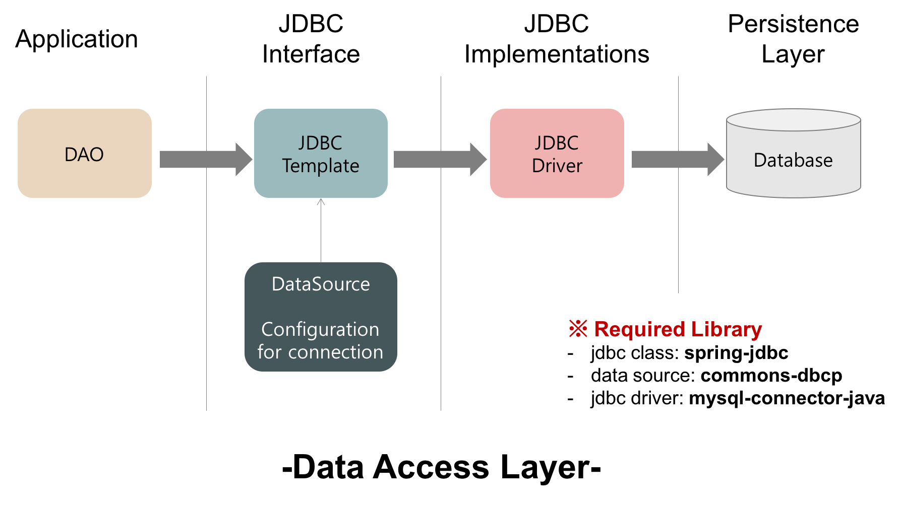

## Spring JDBC를 통한 데이터 접근

`JDBC(Java Database Connectivity)`

> DB에 접근할 수 있도록 Java에서 접근하는 API(모든 Java의 Data Access 기술의 근간)

- 데이터베이스에서 자료를 쿼리하거나 업데이트하는 방법 제공
- 문제점
  - 쿼리를 해결하기 전과 후에 많은 코드를 작성해야함(연결 생성, 명령문, ResultSet 닫기 등)
  - 데이터베이스 로직에서 예외 처리 코드를 수정해야 한다.
  - 트랜잭션을 처리해야 한다.
  - 이러한 코드의 반복으로 인한 시간 낭비

### JDBC Template
> Spring JDBC 접근 방법 중 하나로, 내부적으로 Plain JDBC API를 사용하지만 위와 같은 문제점을 제겅한 형태로 스프링이 제공하는 클래스

- 스프링 JDBC가 하는 일
  - Connection 열기 닫기
  - Statement 준비 닫기
  - Statement 실행
  - ResultSet Loop 처리
  - Exception 처리 및 반환
  - Transaction 처리

- 개발자가 할 일
  - 핵심적으로 해야 할 작업만 해주면 나머지는 Framework가 알아서 처리
  - datasource 작성
  - sql문 작성
  - 결과 처리

- JDBC Template이 제공하는 기능
  - 실행: Inser, Update와 같이 DB의 데이터에 변경이 일어나는 쿼리를 수행하는 작업
  - 조회: Select를 이용해 데이터를 조회하는 작업
  - 배치: 여러 개의 쿼리를 한 번에 수행해야 하는 작업

### JDBC Driver
자바 프로그램의 요청을 DBMS가 이해할 수 있는 프로토콜로 변환해주는 클라이언트 사이드 어댑터
- DB마다 Driver가 존재하므로 자신이 사용하는 DB에 맞는 JDBC Driver를 사용한다.
- DataSource를 JDBC Template에 주입(Dependency Injection) 시키고 JDBC Template은 JDBC Driver를 이용해 디비에 접근한다.


### Data Access Layer



#### DAO(Data Access Object)
- 실제로 DB에 접근하는 객체
- Service와 DB를 연결하는 고리 역할
- "Object" 단위 - SQL을 이용한 CRUD -> DB의 "record" 단위로 저장
  - 오브젝트와 레코드 간의 miss match 발생 가능

#### DataSource
JDBC 명세의 일부분이면서 일반화된 연결 팩토리

즉, DB와 관계된 connection 정보를 담고 있으며, bean으로 등록해 인자로 넘겨준다.

이 과정을 통해 스프링은 DataSource로 DB와의 연결을 획득한다.

**역할**
- DB Server와의 기본적인 연결
- DB Connection Pooling 기능
- 트랜잭션 처리

`DB Connection Pooling`
- 자바 프로그램에서 데이터베이스에 연결하는 것(Connection 객체를 얻는 것)은 시간이 오래 걸린다.
- 만약 일정량의 connection을 미리 생성시켜 저장소에 저장했다가 프로그램에서 요청이 있으면 저장소에서 Connection에서 꺼내 제공한다면 시간을 절약할 수 있다.
- 이러한 프로그래밍 기법을 Connecting Pooling 이라고 한다.
- 속도와 퍼포먼스를 향상시킨다.

**reference** </br>
https://gmlwjd9405.github.io/2018/05/15/setting-for-db-programming.html


## tomcat 내부구조

**reference**
https://byungmin.tistory.com/61

## 톰캣 기본 사이즈, 최대 사이즈
**JVM 메모리**

메모리 기본 설정값의 경우 아무 설정을 하지 않을 경우 jvm의 설정을 그대로 따라간다.

물리 메모리의 1/64를 초기 힙사이즈로 할당하고 1/4를 최대 힙사이즈로 할당한다.

Post로 넘길 수 있는 파라미너의 최대 크기: 2097152(2 megabytes)

최대 개수: 10,000개

(8.0 기준)


**reference**

https://mine-it-record.tistory.com/237

https://findmypiece.tistory.com/236

## N+1 문제
> 연관관계가 설정된 엔티티를 조회할 경우에 조회된 데이터 갯수(n)만큼 연관관계의 조회 쿼리가 추가로 발생하여 데이터를 읽어오는 현상

- WHEN: JPA Repository를 활용해 메소드를 호출할 때(Read)
- WHO: 1:N or N:1 관계를 가진 엔티티를 조회할 때 발생
- JPA Fetch 전략이 EAGER 전략으로 데이터를 조회하는 경우
- JPA Fetch 전략이 LAZY 전략으로 데이터를 가져온 이후에 연관 관계인 하위 엔티티를 다시 조회하는 경우
- WHY: JPA Repository로 find 시 실행하는 첫 쿼리에서 하위 엔티티까지 한 번에 가져오지 않고, 하위 엔티티를 사용할 때 추가로 조회하기 때문에
- JPQL은 기본적으로 글로벌 Fetch 전략을 무시하고 JPQL만 가지고 SQL을 사용하기 때문에

### EAGER(즉시 로딩)인 경우
1. JPQL에서 만든 SQL을 통해 데이터 조회
2. 이후 JPA에서 Fetch 전략을 가지고 해당 데이터의 연관 관게인 하위 엔티티들을 추가 조회
3. 2번 과정으로 N+1 문제 발생


### LAZY(지연 로딩)인 경우
1. JPQL에서 만든 SQL을 통해 데이터 조회
2. JPA에서 Fetch 전략을 가지지만, 지연 로딩이기 때문에 추가 조회는 하지 않음
3. 하지만 하위 엔티티를 가지고 작업하게 되면 추가 조회가 발생하기 때문에 결국 N+1 문제 발생


### 해결 방법
1. Fetch Join
  - 두 테이블을 조인하는 쿼리를 직접 작성
```
@Query("select DISTINCT o from Owner o join fetch o.pets")
List<Owner> findAllJoinFetch();
```

-> 쿼리가 한 번만 발생하고 미리 owner와 pet 데이터를 조인(Inner Join)해서 가져오는 것을 볼 수 있다.

**단점**
- 쿼리 한 번에 모든 것을 가져오기 때문에 JPA가 제공하는 Paging API 제공 불가능
- 1:N 관계가 두 개 이상인 경우 사용 불가
- 패치 조인 대상에게 별칭(as) 부여 불가능
- 번거로움

2. Entity Graph
  - Fetch Join과 동일하게 JPQL을 통해 쿼리를 작성하고, 필요한 연관관계를 EntityGraph에 설정하면 된다.

```
@EntityGraph(attributePaths = {"pets"})
@Query("select DISTINCT o from Owner o")
List<Owner> findAllEntityGraph();
```

-> 쿼리가 한 번만 발생하고 onwer와 pet의 데이터를 조인(Outer Join)해서 가져온다.

**주의점**
FetchJoin과 EntityGraph는 공통적으로 카테시안 곱(Cartesian Product)이 발생해 중복이 생길 수 있다.

`카테시안 곱`: 두 테이블 사이에 유효 join을 적지 않았을 때 해당 테이블에 대한 모든 데이터를 전부 결합해 테이블에 존재하는 행 갯수를 곱한만큼의 결과 값이 반환되는 것

이를 해결하기 위한 방법으로는 다음과 같은 것들이 있다.
1. JPQL에 DISTINCT를 추가해 중복 제거
2. OneToMany 필드 타입을 Set으로 선언해 중복 제거

**refernece**

https://dev-coco.tistory.com/165